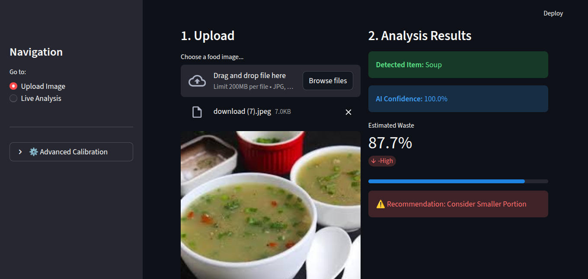

# 🍽️ EcoPlate: AI Food Waste Tracker

**Term Project: AI Solution Development & Prototyping**
**Course:** Artificial Intelligence

## 📖 Project Overview
**EcoPlate** is a functional AI prototype designed to automate food waste tracking. Moving beyond theoretical concepts, this project implements a computer vision pipeline to identify food types and estimate waste volume on a plate.

The system addresses real-world sustainability by applying AI techniques to calculate the percentage of uneaten food and provide actionable recommendations.


---

## 🚀 Features
* **📸 Live Analysis:** Real-time food detection using webcam feed.
* **📂 Upload Mode:** Support for static image analysis (JPG/PNG).
* **🧠 AI Classification:** Identifies 11 distinct food classes (e.g., Rice, Meat, Fried Food) using a pre-trained **EfficientNetB3** model.
* **📉 Smart Waste Calculation:** Uses OpenCV image processing to calculate the percentage of uneaten food.
* **⚙️ Shadow Calibration:** Adjustable sensitivity settings to handle different lighting conditions.

---

## 🛠️ Tech Stack
* **Language:** Python 3.9+
* **Interface:** Streamlit
* **Core AI:** TensorFlow / Keras
* **Image Processing:** OpenCV & Pillow

---

## 📦 Installation & Setup Guide

Follow these strictly ordered steps to run the application on your local machine.

## Step 1: Install Python
Ensure you have Python installed. You can verify this by typing the following in your terminal:
```bash
python --version
```
## Step 2: Clone the Repository

Open your terminal or command prompt and run the following commands to download the project and enter the folder:

```bash
git clone https://github.com/zeeshan933/EcoPlate-AI.git
cd EcoPlate-AI
```
## Step 3: Create a Virtual Environment (Recommended)

It is highly recommended to use a virtual environment to keep dependencies organized.

### Windows

```bash
python -m venv venv
.\venv\Scripts\activate
```
### Mac / Linux
```bash
python3 -m venv venv
source venv/bin/activate
```

## Step 4: Install Dependencies

Install all required libraries automatically using the requirements.txt file:

```bash
pip install -r requirements.txt
```

## Step 5: Setup Model Files (CRITICAL)

The application requires the trained AI model to function. Ensure the following files are placed in the root directory of the project:

- `EfficientNetB3_food_waste_model.h5` (Trained AI Model)
- `class_indices.json` (Label mapping file)

> **Note:** If the `.h5` file is missing, the app will display a **"Model not found"** error.

## Step 6: Run the Application

Execute the following command to start the web interface:

```bash
streamlit run app.py
```

The application should automatically open in your browser at:  
http://localhost:8501

## 📂 Project Structure
```
├── app.py                            # Main application script
├── requirements.txt                  # List of Python dependencies
├── EfficientNetB3_food_waste_model.h5 # Trained AI Model (Required)
├── class_indices.json                # JSON mapping for food labels (Required)
└── README.md                         # Documentation
```

## 🤖 AI Usage Declaration

In compliance with the "No Copy-Paste" Rule and Academic Integrity guidelines, the following AI tools were utilized in the development of this project:

### Project Concept & Scope
- **Tool:** ChatGPT / Gemini  
- **Usage:** Brainstormed ideas from the "100 AI Ideas" list and refined the scope to a feasible "Food Waste Tracker".

### Code Assistance
- **Tool:** GitHub Copilot / LLMs  
- **Usage:** Generated boilerplate code for the Streamlit sidebar layout and assisted in debugging OpenCV thresholding errors.  
- **Clarification:** The core logic for waste calculation (`process_image` function) and model integration was manually implemented and verified by the student.

### Documentation
- **Usage:** AI was used to help format this README file and check for clarity.

### Declaration
No part of this project code was blindly copy-pasted. The student is fully capable of explaining every line of code during the viva.


## 👨‍💻 Author

**Name:** Zeeshan Khalid  
**Student ID:** F2025436011  
**Course:** AI5301 - Advanced Artificial Intelligence
